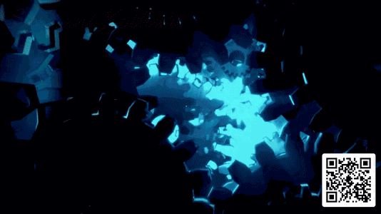

<!-- ████████████████████ ANIMATED HEADER WAVE ████████████████████ -->

<!-- ████████████████████ BANNER GIF ████████████████████ -->

  

<!-- ████████████████████ SOCIAL BADGES ████████████████████ -->

  
  
  
  
  

 

<!-- ████████████████████ INTRO ████████████████████ -->
<h2>  I am Sushant Kothari and I am a</h2>

<h3>

- **📫 How to reach me:** **sk619kothari@gmail.com**
- **🌐 Portfolio:** [sushant-kothari-portfolio.vercel.app](https://sushant-kothari-portfolio.vercel.app/)
- **📄 Resume/CV:** [View Here](https://drive.google.com/file/d/1lI8EYSGLt_EWGWw_hL6xQi0HvgRHQIK7/view?usp=sharing)
- 💼 **Career Status:** **Open to Data Science, Machine Learning & AI Roles**
- 🎓 **Education:** M.Tech in Data Science (CGPA: 9.16) & B.Tech in CS DS (CGPA: 9.26)
- 🌱 **Currently Learning:** Advanced Data Analytics, Big Data Engineering, GenAI & LLMs
- 💬 **Ask me about:** Data Science, Machine Learning, Deep Learning, GenAI, CV & NLP
- 👨‍💻 **All projects at:** [github.com/sushantkothari](https://github.com/sushantkothari)
- ⚡ **Fun fact:** "Data Wizard" casting spells with Python to conjure insights and predict the future! 🧙‍♂🔮
- ⚡ **Technical Fun fact:** My favorite dance? The Neural Network Shuffle — two steps forward, one back, then gradient descent! 💃📉

</h3>

---

<!-- ████████████████████ MY RESEARCH PUBLICATIONS ████████████████████ -->
<h2 align="center">📚 My Research Publications</h2>

<table border="0" width="100%">
  <tr>
    <td style="background-color: #1a1b26; padding: 16px; border-radius: 8px;">
      <h3 align="left">
        <a href="https://www.irjms.com/wp-content/uploads/2026/04/Manuscript_IRJMS_09113_WS.pdf" target="_blank">
          📄 Air Quality Index Prediction Using Hybrid LSTM–GRU and Residual BiLSTM Models
        </a>
      </h3>
      

        
        &nbsp;&nbsp;
        
      

      

        <h4>📖 Journal: <i>International Research Journal of Multidisciplinary Scope (IRJMS) — Vol. 7, Issue 2, 2026</i></h4>
        <h4>💡 Highlights: <i>Hybrid LSTM-GRU & Residual BiLSTM deep learning architecture engineered for high-precision AQI forecasting.</i></h4>
      

    </td>
  </tr>
</table>

 

<table border="0" width="100%">
  <tr>
    <td style="background-color: #1a1b26; padding: 16px; border-radius: 8px;">
      <h3 align="left">
        <a href="https://www.irjms.com/wp-content/uploads/2026/07/Manuscript_IRJMS_09519_WS.pdf" target="_blank">
          📄 Hybrid Wildlife Classification and Detection Using EfficientNet-B4, Custom CNN and YOLOv10
        </a>
      </h3>
      

        
        &nbsp;&nbsp;
        
      

      

        <h4>📖 Journal: <i>International Research Journal of Multidisciplinary Scope (IRJMS), 2026</i></h4>
        <h4>💡 Highlights: <i>Multi-model Computer Vision pipeline integrating EfficientNet-B4, Custom CNN backbone, and YOLOv10 for real-time species detection.</i></h4>
      

    </td>
  </tr>
</table>

---

<!-- ████████████████████ TECHNICAL SKILLS & COMPETENCIES ████████████████████ -->
<h2 align="center">Technical Skills & Core Competencies</h2>

 

### Programming & Core Languages

  
  
  

### LLM, Generative AI & NLP

  
  
  
  
  
  
  

### Machine Learning & Deep Learning Frameworks

  
  
  
  
  
  
  

### Computer Vision & Multimodal AI

  
  
  
  
  

### Data Science, Analytics & Visualization

  
  
  
  
  
  
  
  

### Cloud, AI Services & MLOps Tools

  
  
  
  
  
  
  
  
  

---

<!-- ████████████████████ GITHUB STATS ████████████████████ -->
<h2 align="center">📊 GitHub Stats & Overview</h2>

  
  &nbsp;
  
  &nbsp;
  

  
  

<!-- ████████████████████ GITHUB TROPHIES ████████████████████ -->
<h2 align="center">🏆 GitHub Trophies</h2>

  

 

<!-- ████████████████████ CONTRIBUTION GRAPH ████████████████████ -->
<h2 align="center">📈 Past 6 Months Contribution Graph</h2>

  

 

<!-- ████████████████████ WAVE DIVIDER ████████████████████ -->

<!-- ████████████████████ SNAKE ████████████████████ -->
<h2 align="center">🐍 Contribution Snake</h2>

  

<!-- ████████████████████ ISOMETRIC CITY (auto-generated by metrics.yml action) ████████████████████ -->
<h2 align="center">🏙️ 3D Isometric Contribution City</h2>

  

---

<!-- ████████████████████ LATEST ARXIV AI/ML PAPER ████████████████████ -->
<h2 align="center">🔥 Daily AI/ML Research Paper from ArXiv</h2>

<!--START_ARXIV-->
<h3 align="center">📄 <a href="https://arxiv.org/abs/2608.18066v1" target="_blank">On the Fragility of Self-Improving Agents: Variance, Task Order, and Underspecification</a></h3>

<b>👥 Authors:</b> Qinyuan Ye, Yu Li et al.

<!--END_ARXIV-->

<!-- ████████████████████ SPOTIFY ████████████████████ -->
<h3 align="center">Currently Listening on Spotify</h3>

  

---

<!-- ████████████████████ CONNECT ████████████████████ -->
<h3 align="left">📫 Connect with me:</h3>

  
  
  
  

 
<h2>Thank you for visiting my GitHub profile. Dive into my projects, star ⭐ your favorites, and let's collaborate on building the future of technology together!</h2>

<!-- ████████████████████ FOOTER WAVE ████████████████████ -->

---

<!-- ████████████████████ PHILOSOPHICAL QUOTE — ABSOLUTE LAST ████████████████████ -->
<!--START_QUOTE-->

  

<!--END_QUOTE-->
